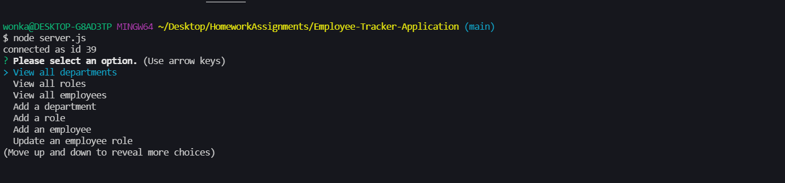
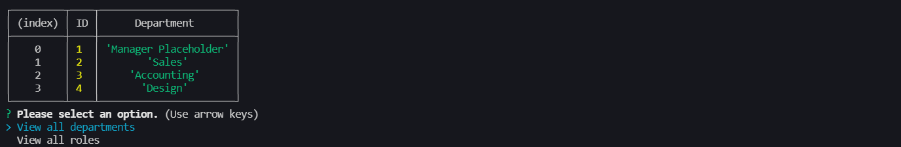
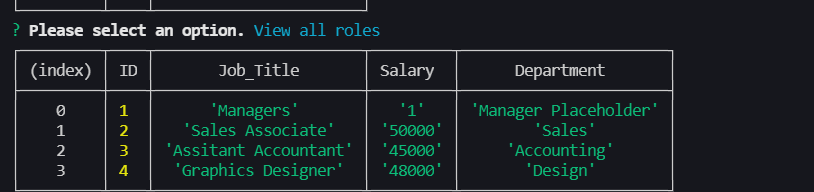
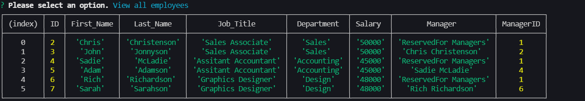
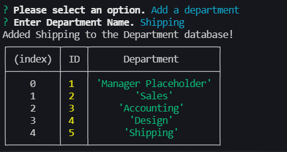
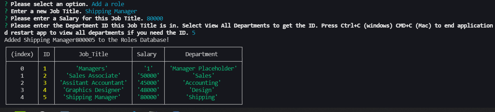
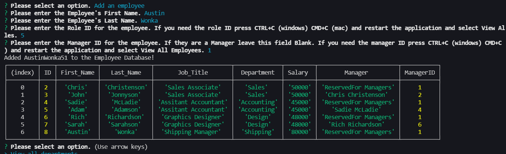
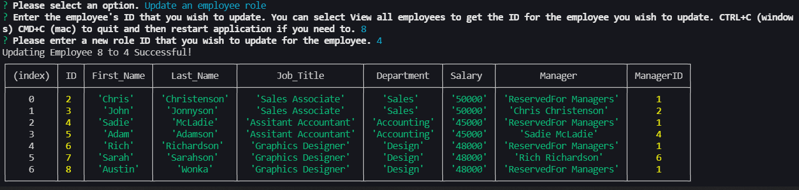

# Employee-Tracker-Application

## Link to video
https://www.youtube.com/watch?v=mkzn3XXeMhA

## How to use this application
To begin using this application you need to open your terminal in the root folder and type "node server.js". The first thing you will see is a list of selections. Select any one of these options to use the app.

If you want to view all departments you will select the "View all departments" options which then will show you a formatted table like below.

The initial prompt will then show up again, to view all roles you will select "View all roles" which then shows a formatted table like below.

The initial prompt will then show up again, to view all employees select "View all employees" which will show a formatted table like below.

If you want to add a department you must select "Add a department" You will then be prompted to add a department name and once you add a department it will add that department to the department list.

If you want to add a role you need to select "Add a role" you must reference the department ID so make sure you have that ID before you go to add a new role.

If you want to add an employee you need to select "Add an employee" you must have the role ID and Manager ID for the employee so make sure you have those before you add the employee by viewing employees and viewing roles. If the employee is a Manager select the Manager ID as 1 as that is reserved for Managers.

If you want to update an employee's role you need to select "Update an employee role". You must have the employee ID and role ID you wish to update before hand so if you need that make sure you view all employees and roles to retrieve those IDs. Then you need to type those ID's into the prompts and you can then update that employee to a new role!

If you wish to end the application select "End application"
